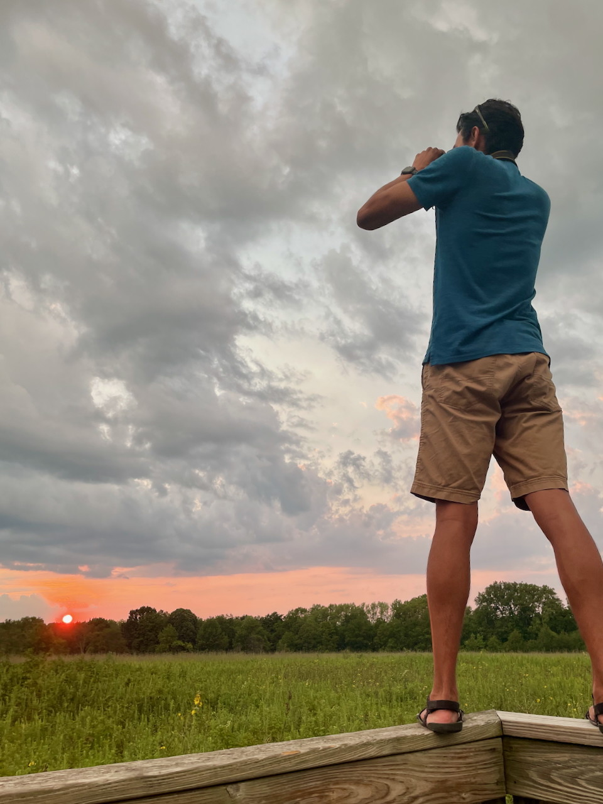
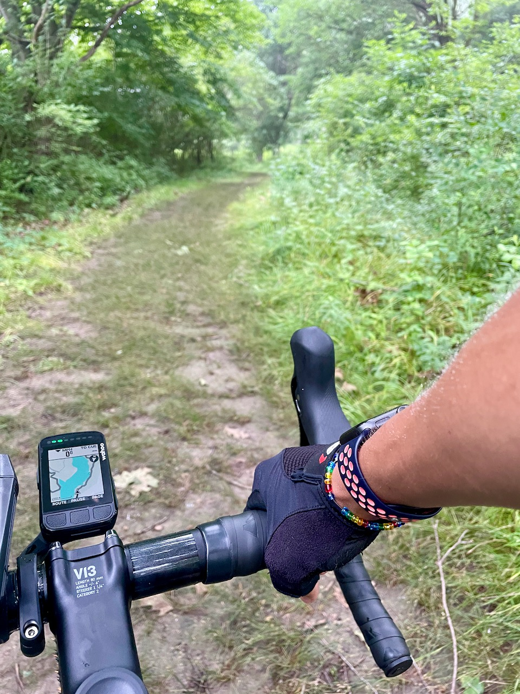

<!--  -->

Hi, I’m Juan! I love learning about anything and everything, trying out new things, and going on adventures. I’ve dabbled in many areas and hobbies over the years, acquiring a wide range of skills in areas like data science, teaching, graphic design, foreign languages, [coding](https://github.com/juandpinto), editing, photography---you name it.

But first and foremost, I’m a family man 🧔🏾‍♂️👱🏼‍♀️🧑🏽👧🏽👦🏽🐈🐈‍⬛. I’m also passionate about the potential of effectively using technology to increase access to high-quality education around the world. This interest has brought me to my current position as a data scientist at McGraw Hill, where I work at the exciting intersection of AI and education. I have a PhD from the University of Illinois Urbana-Champaign.



I originally hail from the beautiful country of Colombia 🇨🇴---in case you're wondering which fútbol team I'll be rooting for. I've now spent most of my life in the United States, though I've done a good bit of traveling and love the diversity on this planet. When I'm not in front of a computer wrangling big datasets, you'll usually find me running around with my kids, riding 🚴🏽‍♂️ through the cornfields of central Illinois, or looking for birds 🦜 in a nearby park.

<!--  -->



<!--  -->
