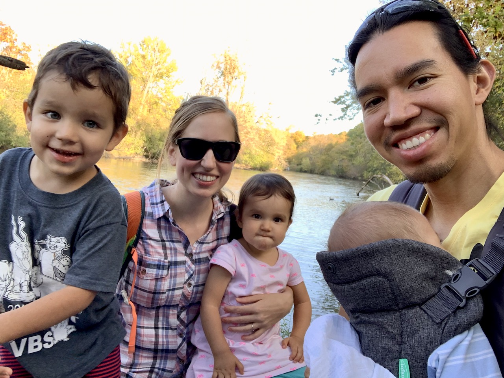
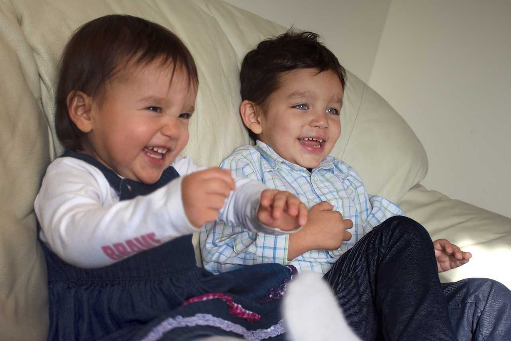
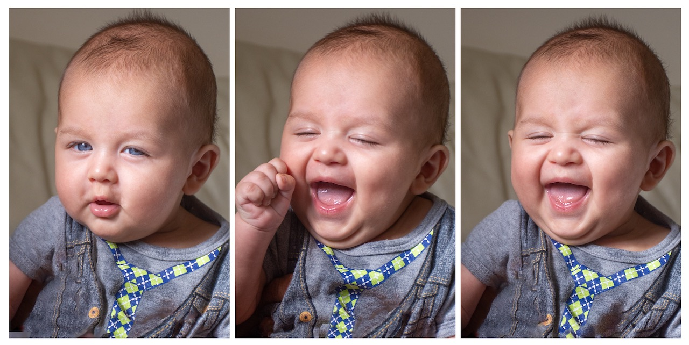
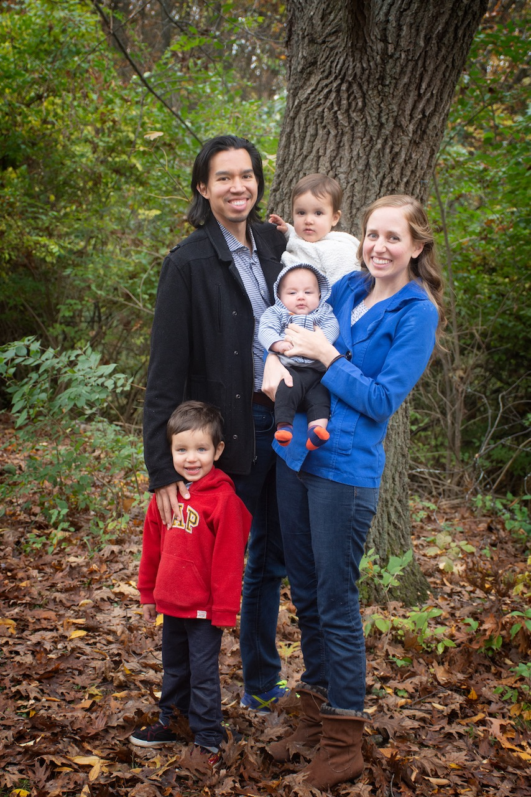

**Dear family and friends,**

Inspired by a good friend and his regular family emails (and as part of our effort to cut back on social media), we've decided to keep loved ones more up-to-date on the goings on of our lives in a similar fashion. And what better time to start this than at the end of a year so full of life changes?

Here's a summary breakdown of what 2019 brought the Pinto family:

- Juan finished his Fulbright in Israel and returned to the States in June after a three-month separation (Jaime and the kids flew back in March). It was sad for us all to leave behind good friends and memories, but we were also so happy to be back home.
- Joaquin Esteban Pinto was born at the beginning of August. Unexpectedly, he was born with a condition called imperforate anus and had to undergo life-saving surgery his second day on Earth. He's lived with a colostomy ever since, meaning that he poops into a baggie out the side of his tummy. This has all reminded us of our countless blessings—especially that we live in this age of modern medicine.
- We moved to Michigan in September, where Juan is going to school and working. Ishmael and Lucia also started daycare, which has had a tremendously positive impact on their comfort around other kids.
- Joaquin had his second surgery in November. The next and (hopefully) final surgery is scheduled for January 20th.

We're so eternally grateful to Jaime's wonderful mother for helping us out during Joaquin's surgeries! She's flying out here to Ann Arbor for his next surgery as well.

And now, for our individual update blurbs:

**Juan** is now doing a one-year masters degree in educational studies with an emphasis in design and technologies for learning. He's also doing an internship as a learning experience designer at the University of Michigan's Center for Academic Innovation, and he's working as a graduate student instructor for a class on the history of college athletics (Juan? Sports? I know, I know). It's been a ton of work this semester, but he's been loving it all.

**Jaime** has loved having the toddlers in daycare the last couple of months. It's allowed her to spend more quality time with Joaquin and also to work on self care. She continued teaching VIPKid through most of the year, but she's recently accepted a different position working online from home. She really likes Ann Arbor, especially because everyone speaks English, we have a car, and it doesn't get as hot as Israel.

**Ishmael** turned three this year, and his English has made leaps and bounds! Between time with grandma and daycare, it's been amazing to hear him code switching with ease. We're always impressed with his ability to carry a tune—he already sings way better than Juan. He also loves making faces and sounds to get Joaquin to laugh. But, of course, his favorite thing in the world is to torment his little sister.

**Lucia** turned two this year. She learned to talk, and now we can't get her to stop. Except around strangers, when she suddenly forgets how to do anything other than cling to her parents' legs. She loves to eat anything and everything. We also love that she hasn't outgrown her super cuddly phase. But, of course, her favorite thing in the world is to torment her big brother.

**Joaquin** has been our baldest and cuddliest baby. Each child has come with less and less hair and in need of more and more snuggles. He is a sweet and happy baby and a joy to have in our family. He loves sucking on his hands and whatever he can get a hold of. Luckily, his favorite thing isn't tormenting his siblings. At least not yet.

Finally, here's a fun four-minute video made up of one second for *almost* every day this year in the Pinto family:



Creating these video collages has become a sort of end-of-year tradition for us. We can now add this one to our [2018](https://www.youtube.com/watch?v=Q40u_2o7elY) and [2017](https://www.youtube.com/watch?v=1toGtLkRUxM) memory videos.

So that's 2019 in a nutshell! Hope you've all had a Merry Christmas, a Hag Sameach, and that 2020 brings you many blessings and much joy. If we haven't heard from you recently, feel free to respond to this email—we'd love to hear how you're doing!

Love, 
**Juan, Jaime, Ishmael, Lucia, and Joaquin**

