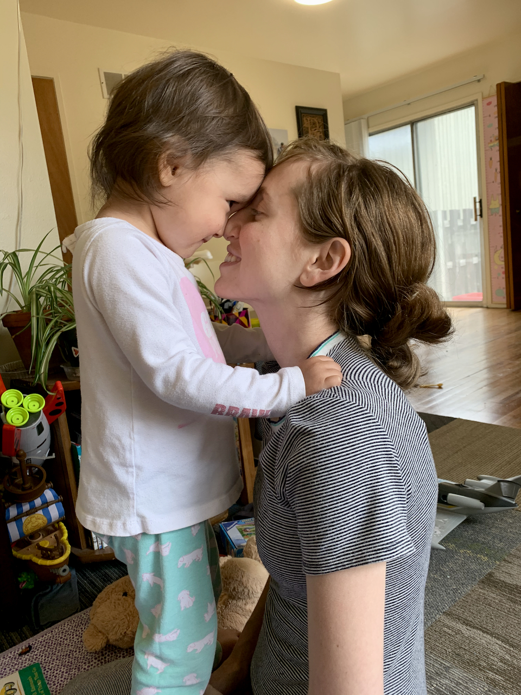
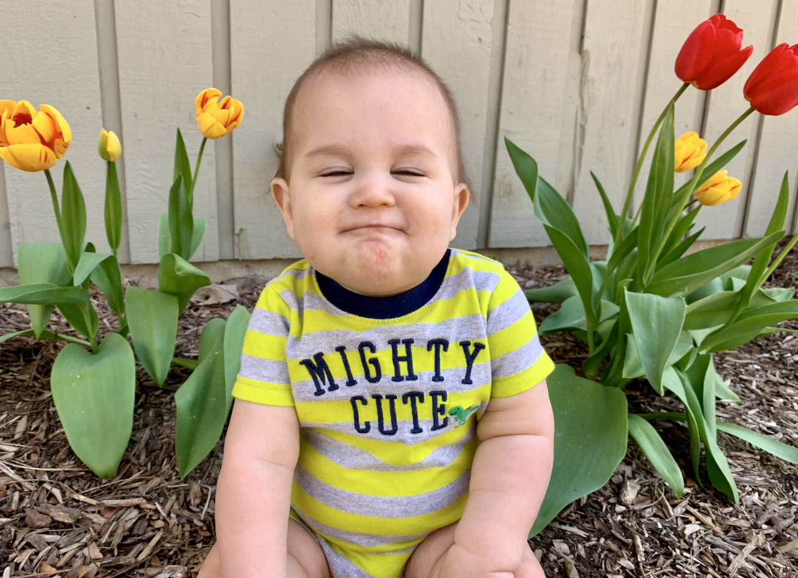

**Querida familia y amigos,**

Esperamos que durante esta pandemia todos estén manteniéndose física, mental y espiritualmente saludables. Sabemos que las cosas han cambiado drásticamente para todos desde que enviamos nuestra última actualización familiar en diciembre, pero esperamos que muchos de los propios cambios en sus vidas hayan sido positivos.

 

Estos son algunos de los giros que ha dado nuestra vida durante los últimos seis meses:

- La cirugía final de Joaquín en enero estuvo perfecta, y desde entonces ha estado defecando como un humano normal. 💩 Bueno, hace caca con *mucha* más frecuencia que la mayoría de las personas, pero eso es normal para su condición. ¡Comenzó a gatear arrastrándose y empujándose con sus bracitos hace unos dos meses, pero esta semana ha descubierto cómo gatear en cuatro "paticas" y ahora es imparable!
- A Ishmael y Lucía les sigue encantando atormentarse mutuamente. Afortunadamente, también les encanta jugar juntos. 🙃
- Desde que la cuarentena en Michigan comenzó en marzo, en realidad ha sido muy agradable para Juan Daniel trabajar desde casa todo el tiempo. Ahora no tiene muchas ganas de volver al campus cuando todo esto termine. Juan Daniel completó su segundo máster y ya comenzó a trabajar en su doctorado sobre ambientes de aprendizaje digital (especializado en ciencia de datos educativos) en la Universidad de Illinois en Urbana-Champaign. Ahora está en camino de convertirse en un coleccionista de títulos universitarios. 🎓
- ¡Nos mudamos a Illinois esta semana! Jaime está especialmente emocionada de vivir cerca de su hermana ahora, con quien ya comenzó a hacer caminatas por la mañana.

Aquí hay algunas cosas divertidas que se han dicho recientemente en la casa:

- **Lucía, cantando:** "Twinkle Twinkle Little Star! How I wonder in the sky!"
- **Lucía:** "Mamá, ¿quieres escucharlo en español o en inglés?"
- **Jaime:** "¿Qué tal en español?"
- **Lucía:** "De acuerdo. TWINKLE TWINKLE LITTLE STAR!"

Y un par de otras gemas:

- **Ishmael, envuelto en su manta:** "¡Soy una princesa de papá!"
- **Lucía, señalando la bacinilla después de haberla usado:** "Esa es una caca papa, y hay una caca mamá, y también hay una caca bebé".
- A nuestros amigos estadounidenses, *¡Feliz 4 de julio, día de la independencia!* Tomémonos este tiempo para agradecer por nuestras libertades y al mismo tiempo reflexionar sobre las muchas personas que no han tenido acceso a estas mismas libertades en el pasado o en el presente, debido a su color de piel, género, orientación sexual, situación económica, lugar de origen, o cualquier otro factor.

")

Por último, ¡a este pequeño y lindo chico de abajo le encantaría saber de ti! (Y a nosotros también). ¡Escríbannos!

Con amor, 
**Juan, Jaime, Ishmael, Lucia, y Joaquin**
