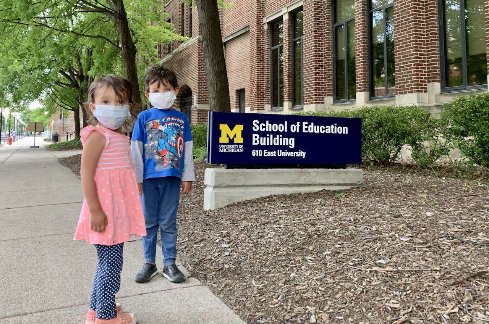



Esta página aún no ha sido traducida al español.



**Dear family and friends,**

We hope you're all staying physically, mentally, and spiritually healthy during this pandemic. Things have changed quite drastically for everyone since we sent out our last family update in December, but we hope that many of your own life changes have been positive.

 

Here are some of our own life changes:

- Joaquin's final surgery in January went perfectly, and he's been pooping like a normal human ever since. 💩 Well, he poops *much* more often than most humans, but that's normal for his condition. He started army crawling about two months ago, but this week has figured out how to crawl upright and is now unstoppable!
- Ishmael and Lucia continue to love tormenting each other. Luckily, they also enjoy playing together. 🙃
- Since Michigan's stay-at-home order began in March, it's actually been really nice for Juan to work from home all the time. He's not looking forward to going back to campus when this is all over.
- Juan completed his second master's degree and has already begun working on his PhD in digital learning environments (specializing in educational data science) at the University of Illinois at Urbana-Champaign. He is now well on his way to becoming a degree collector. 🎓
- We moved to Illinois this week! Jaime is especially excited to live near her sister now, with whom she's begun taking morning walks.

Here are some fun things that have recently been said around the house:

- **Lucia, singing:** "Twinkle Twinkle Little Star! How I wonder in the sky!"
- **Lucia:** "Mama, do you want to hear it in Spanish or English?"
- **Jaime:** "How about in Spanish?"
- **Lucia:** "Okay. TWINKLE TWINKLE LITTLE STAR!"

And a couple other gems:

- **Ishmael, wrapped up in his blanket:** "I'm a Papa Princess!"
- **Lucia, pointing to the potty after she's used it:** "That's a papa poop, and there's a mama poop, and that's a baby poop too."

To our American friends, *happy 4th of July*! 🇺🇸 Let's take this time to be grateful for our freedoms while also reflecting on the many people who haven't had access to these freedoms—past or present—because of their skin color, gender, sexual orientation, economic situation, place of origin, or any other factor.

Lastly, this cute little guy below would love to hear from you! (And we would too.)

Love, 
**Juan, Jaime, Ishmael, Lucia, and Joaquin**
