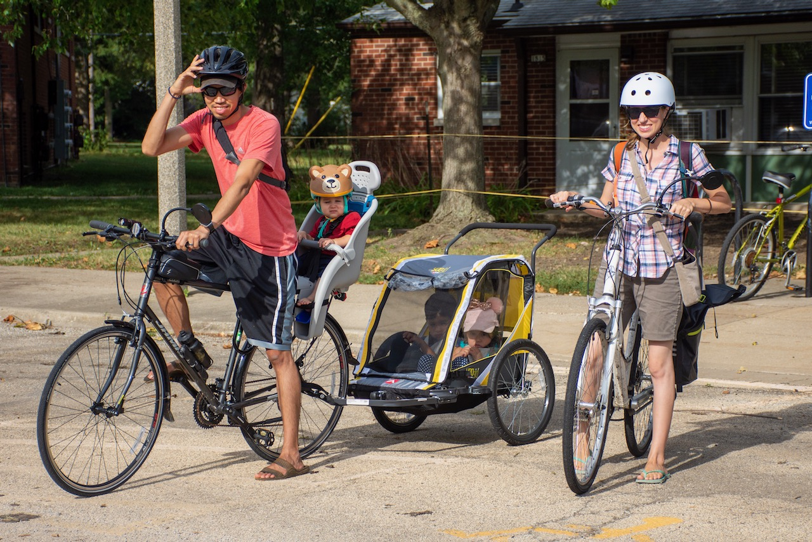
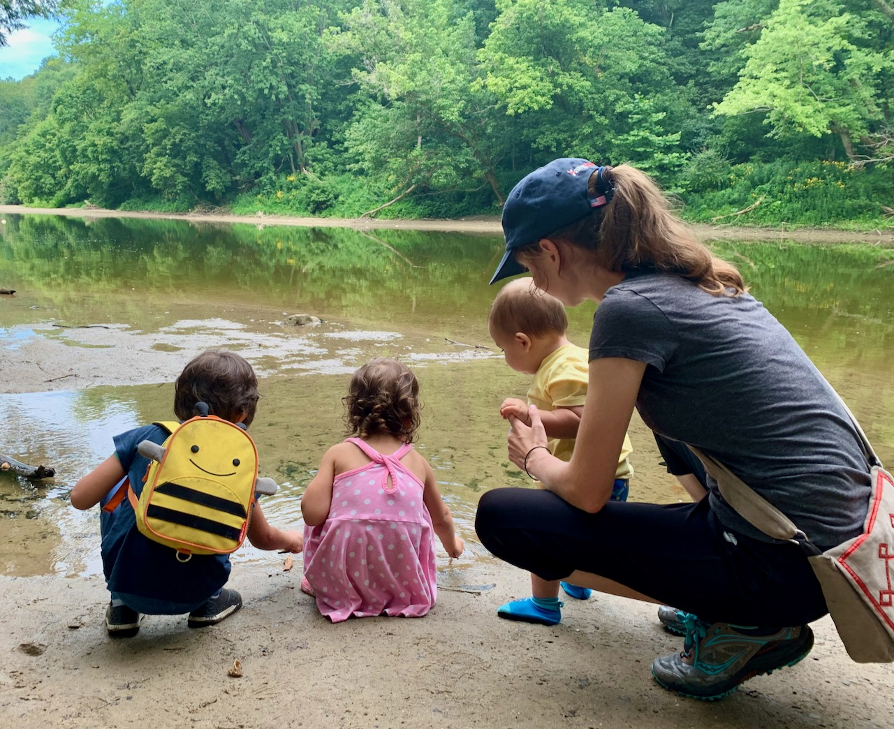
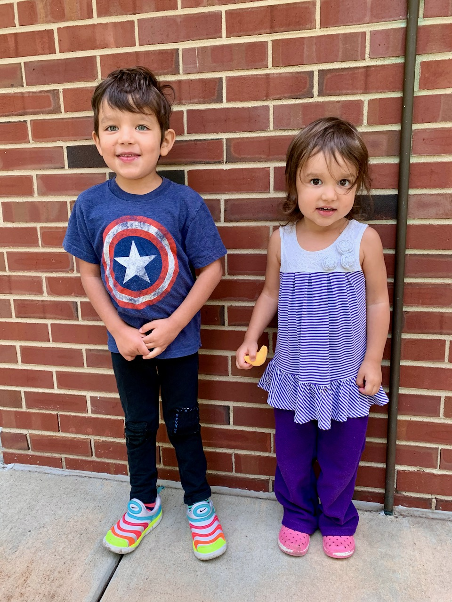
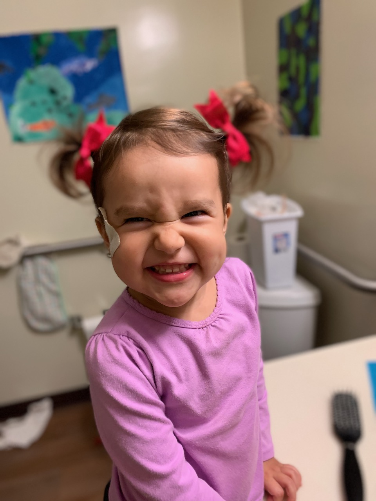
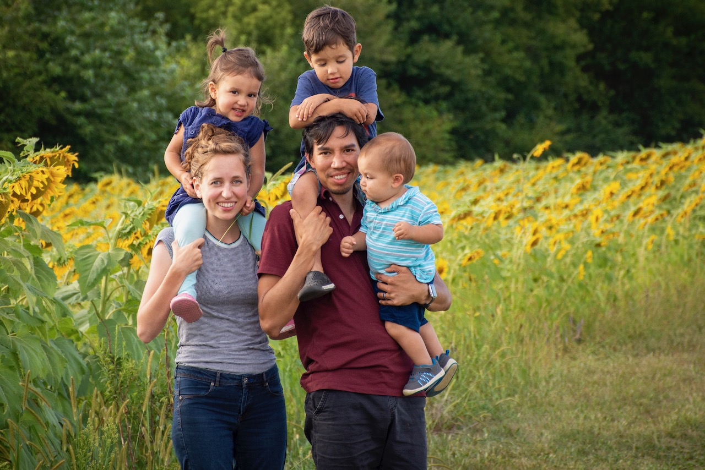

**Dear family and friends,**

What a year this has been. Despite the pandemic and all the turmoil that 2020 has brought, we feel very lucky to not have personally suffered physically or financially in any way. If anything, we feel that this time has brought us closer to each other than ever before. It also helps that we now live walking distance away from Jaime's sister. Her family has been wonderful to us and has made the lockdown so much more bearable.

Some updates:

- **Juan** is loving his PhD at the University of Illinois. After working from his makeshift standing desk in the shower, and especially after an incident in which the kids accidentally turned the water on, he finally moved out of his bathroom office and into a real desk in Joaquin's room for work. Noise-cancelling headphones are almost as effective as the shower curtain.
- **Jaime** has been busy doing her thing. Going on regular morning walks with her sister has been good for the soul, as has having three cute Guinea Pigs to love and to hold and who don't complain incessantly like her human babies.
- **Ishmael** is enjoying his small, in-person, masks-required preschool. He loves to ride his bike, exercise with his dad, and play tag. He would play tag all day every day if he could. He now loves to play with Lucia and Joaquin.
- **Lucia** recently started at the same preschool, and her teacher said it best: "She should definitely be here. She is ready." She loves to be around all the older kids at school, including her brother, and loves to ride her bike and go to the playground with Ishmael and Joaquin.
- **Joaquin** developed opinions shortly after his first birthday in August, and they came strong. He loves to do whatever his older siblings are doing, and darn it why does everything come in twos and not threes! He runs around all day with his arms outstretched for balance. We thought he might slim down, but he is still as chubby as ever because he LOVES to eat. He also loves to tease his mom by saying "papa" whenever she tries to get him to say "mama." He thinks he's just the funniest.

Besides tag and biking, there are two things Ishmael is currently obsessed with: *speed* ("Is my bike faster than the car? Yeah it is, because I'm Dash.") and *death*.

- **Ishmael:** When will I die?
- **Juan:** I don't know.
- **Ishmael:** It's not on the calendar?

Can you guess Lucia's favorite TV show from this interaction?

- **Lucia:** You have to say: fee
- **Juan:** fee
- **Lucia:** gaa
- **Juan:** gaa
- **Lucia:** dout
- **Juan:** dout
- **Lucia:** We jus feegaadout bloos cloos!

 

Finally, as has become our end-of-year tradition, here is a mashup video of one second for *almost* every day this year in the Pinto family. Clearly, our lives very much revolve around our kids. And we love it.



We hope you're all staying healthy and happy through these turbulent times. Brighter days are coming. And as always, **we would love to hear from you!** Let's welcome the new year with open arms, determined to make it something wonderful.

Love, 
**Juan, Jaime, Ishmael, Lucia, and Joaquin**

