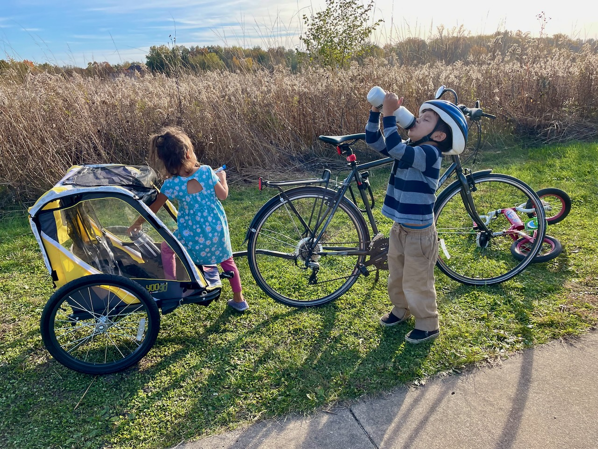
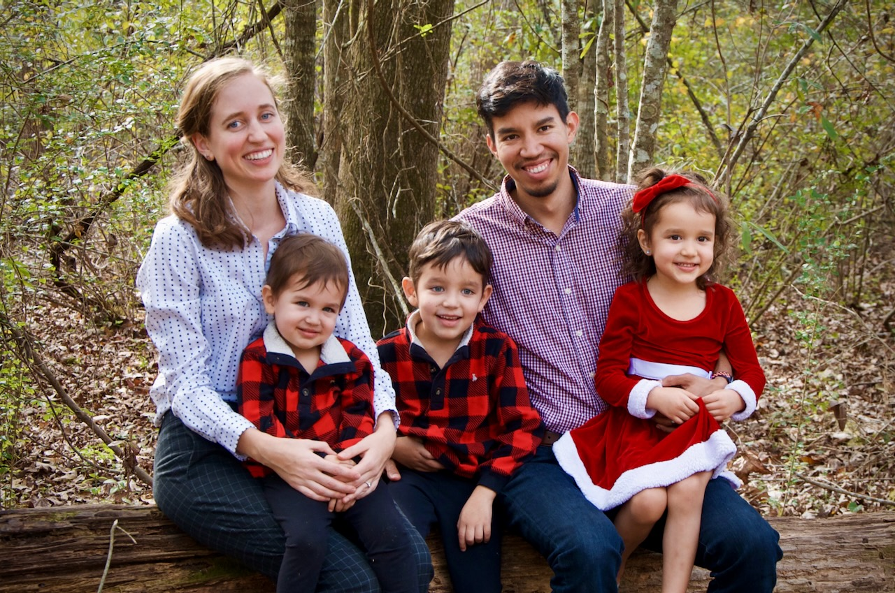

**Dear family and friends,**

As 2021 draws to a close, we wanted to share some of what our family has been up to. We absolutely love it when others reach out with updates of their own, so please do let us know how you're doing!

**Juan** is now in the second year of his PhD program at the University of Illinois and continues learning new things every day. After trying different kinds of exercise to get out of his pandemic rut, Juan trained for and completed two triathlons 🏊🏽‍♂️🚴🏽‍♂️🏃🏾‍♂️ this year and is planning to participate in some gravel bike races in the coming year. He's done more swimming, biking, and running than ever before—except possibly during track season in high school, but that feels like a lifetime ago.

**Jaime** took some classes this year in preparation for a dental hygiene program that she plans to complete while we're still in Illinois. Chemistry and anatomy have been challenging but also fascinating. She continues to work from home in the evenings, but she gets to watch fun movies (and plenty of Korean dramas 📺) while doing it. She's picked up roller skating 🛼 to stay physically and mentally healthy, and now she loves showing off her new moves while rocking out to 80s music.

**Ishmael** is now 5 and in kindergarten, officially making him a big kid (as he has repeatedly informed us). He goes to a bilingual school where he's improving both his Spanish and English. He's constantly asking questions about how the world works, and some of his questions are already getting hard to answer 😅. He likes to skate like his mom and ride his bike like his dad.

**Lucia** is now 4. She loves her small preschool and is really excited to have Joaquin join her next year. She likes to lay on the floor and draw the cutest little people all day. She's also an expert at cutting out her drawings with scissors ✂️. Lucia just learned to ride a real bike like her brother and is sure to join in on the family biking fun throughout this coming year.

**Joaquin** is 2 and tries his hardest to keep up with his siblings when they're running around like wild animals. But as much as he loves doing whatever they're doing, he can also spend hours flipping through picture books 📚 or playing with blocks by himself. Joaquin was hospitalized briefly this year due to a fractured skull, but he healed quickly and without any complications.

**Some additional updates:**

- Along with forcing us to become much more physically active and do more things outdoors, the pandemic also led us to adopt a Siamese cat 🐱 and later a Shih Tzu dog 🐶. And as if our small house didn't already have enough living beings, we also now have more plants than ever. Next up: Pintos living in the jungle.
- The kids loved getting to know their cousins better this year and being more rambunctious than ever around them. Their cousins came up from Texas in the summer and we went down to visit them for winter break. Family time is the best.
- We're currently obsessed with the new Disney movie Encanto (and its music), which badly makes us want to visit our family in Colombia 🇨🇴. If you haven't seen it yet, we highly recommend it!
- In our attempt to create (and continue) our own family traditions, we celebrated Dia de los Muertos for the first time this year and also modified our Thanksgiving meal to fit in with our Colombian and vegan sensibilities.

And, as usual, here is our end-of-year memories video for 2021:



It feels like each year we take less and less pictures/videos of anything other than our kids. And now we also have some cute animals to add to the mix.

We wish all our friends and family a happy new year 🎉🍾! May 2022 be your best year yet!

Love,\
**Juan, Jaime, Ishmael, Lucia, and Joaquin**\
👨🏽👩🏼👦🏻👧🏻👶🏻🐱🐶

