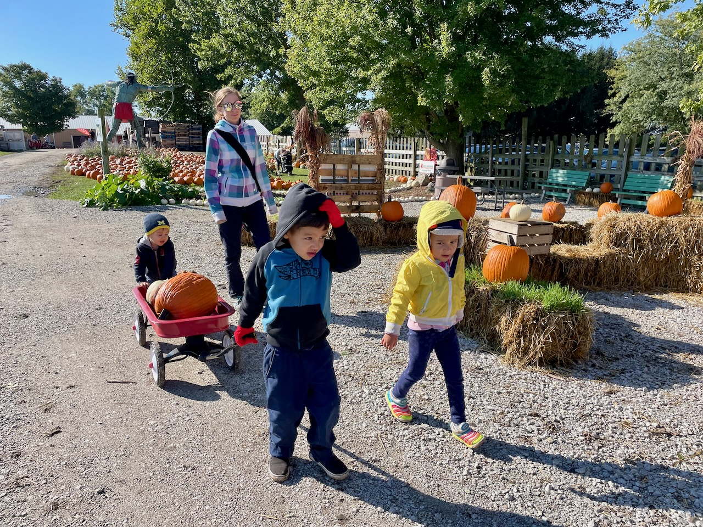
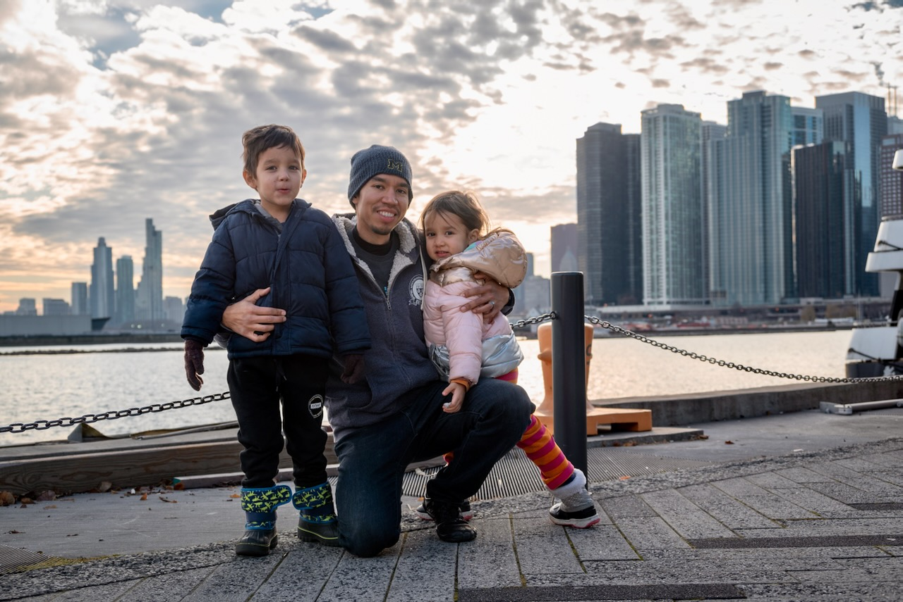
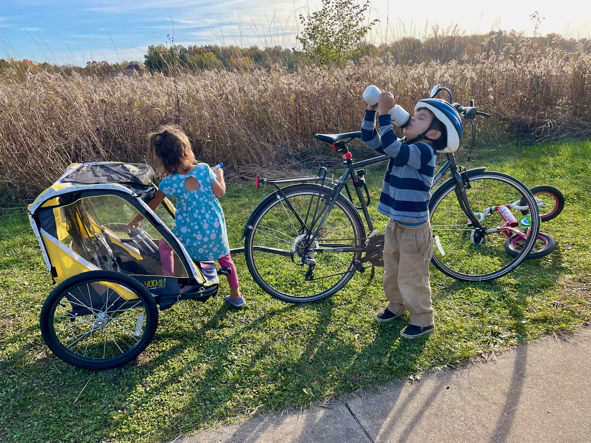
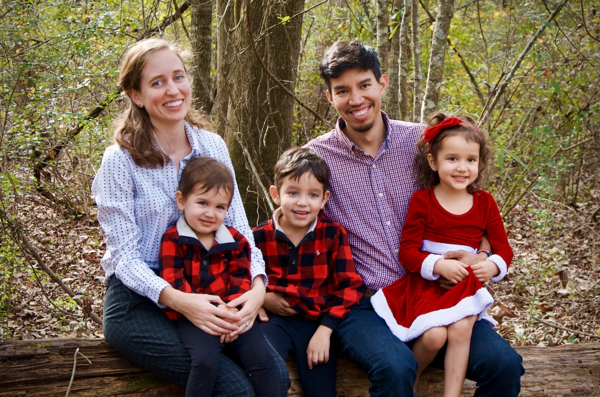

**Querida familia y amigos,**

A medida que el 2021 llega a su fin, quisimos compartir algo de lo que nuestra familia ha estado haciendo. Nos encanta cuando otros se comunican con nosotros, así que déjenos saber cómo les está yendo.

**Juan** está ahora en el segundo año de su programa de doctorado en la Universidad de Illinois y continúa aprendiendo cosas nuevas todos los días. Después de probar diferentes tipos de ejercicio para salir de su rutina pandémica, Juan entrenó y completó dos triatlones 🏊🏽‍♂️🚴🏽‍♂️🏃🏾‍♂️ este año y planea participar en algunas carreras de ruta en bicicleta el próximo año. Ha hecho más natación, ciclismo y carrera que nunca, excepto posiblemente durante la temporada de atletismo en la escuela secundaria, pero eso fue hace ya toda una vida.

**Jaime** tomó algunas clases este año como preparación para un programa de higiene dental que planea completar mientras todavía estemos en Illinois. La Química y la Anatomía han sido un verdadero reto para ella pero también las ha encontrado fascinantes. Continúa trabajando desde casa por las noches, pero puede ver buenas películas (y muchos dramas coreanos 📺) mientras lo hace. Ha elegido el patinaje sobre ruedas 🛼 para mantenerse física y mentalmente sana, y ahora le encanta mostrar sus nuevos movimientos mientras se balancea con la música de los 80.

**Ishmael** ahora tiene 5 años y está en el jardín infantil, lo que lo convierte oficialmente en un niño grande (como nos ha informado repetidamente). Va a una escuela bilingüe donde está mejorando tanto su español como su inglés. Constantemente hace preguntas sobre cómo funciona el mundo, y algunas de sus preguntas ya se están volviendo difíciles de responder 😅. Le gusta patinar como su mamá y andar en bicicleta como su papá.

**Lucía** ahora tiene 4 años. Le encanta su pequeño preescolar y está muy emocionada de que Joaquín se una a ella el próximo año. Le gusta tumbarse en el suelo y dibujar las personitas más lindas todo el día. También es experta en recortar sus dibujos con tijeras ✂️. Lucía acaba de aprender a andar en bicicleta de verdad como su hermano y seguramente se unirá a la diversión familiar en bicicleta durante el próximo año.

**Joaquín** tiene 2 años y hace todo lo posible por seguir el ritmo de sus hermanos cuando corren como animales salvajes. Pero por mucho que le guste hacer lo que sea que estén haciendo, también puede pasar horas hojeando libros ilustrados 📚 o jugando con bloques solo. Joaquín fue hospitalizado brevemente este año debido a una fractura de cráneo, pero se curó rápidamente y sin complicaciones.

**Algunas actualizaciones adicionales:**

- Además de obligarnos a ser mucho más activos físicamente y hacer más cosas al aire libre, la pandemia también nos llevó a adoptar un gato siamés 🐱 y más tarde un perro Shih Tzu 🐶. Y como si nuestra pequeña casa no tuviera ya suficientes seres vivos, ahora también tenemos más plantas que nunca. Siguiente escena de la película: Familia Pinto viviendo en la jungla.
- A los niños les encantó conocer mejor a sus primos este año y ser más bulliciosos que nunca con ellos. Sus primos vinieron de Texas en el verano y bajamos a visitarlos durante las vacaciones de invierno. El tiempo en familia es el mejor.
- Actualmente estamos obsesionados con la nueva película de Disney Encanto (y su música), lo que nos da muchas ganas de visitar a nuestra familia en Colombia 🇨🇴. Si aún no la ha visto, ¡lo recomendamos encarecidamente!
- En nuestro intento de crear (y continuar) nuestras propias tradiciones familiares, celebramos el Día de los Muertos por primera vez este año y también modificamos nuestra comida de Acción de Gracias para que encajara con nuestras sensibilidades colombianas y veganas.

Y, como de costumbre, adjuntamos nuestro video de recuerdos de fin de año para 2021:



Parece que cada año tomamos menos fotos/videos de cualquier otra cosa que no sean nuestros hijos. Y ahora también tenemos algunos animales lindos para agregar a la mezcla.

¡Deseamos a todos nuestros amigos y familiares un feliz año nuevo 🎉🍾! ¡El año del 2022 será el mejor año hasta ahora!

Con amor,\
**Juan, Jaime, Ishmael, Lucía y Joaquín**
👨🏽👩🏼👦🏻👧🏻👶🏻🐱🐶

