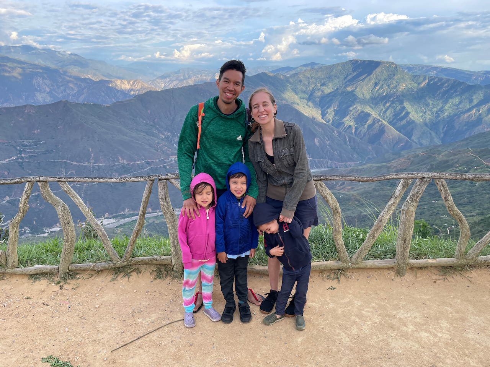
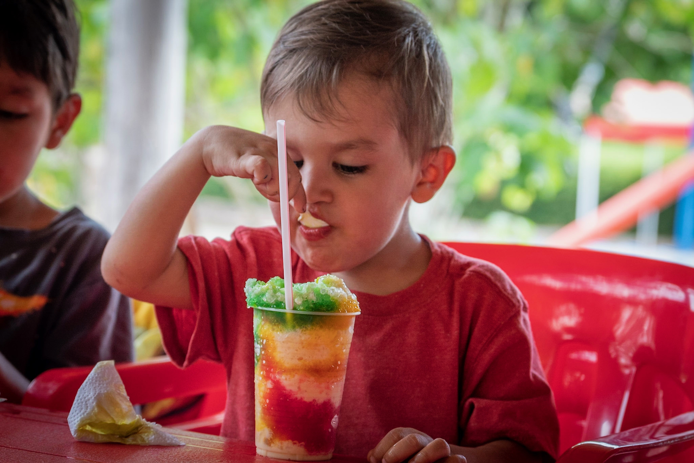
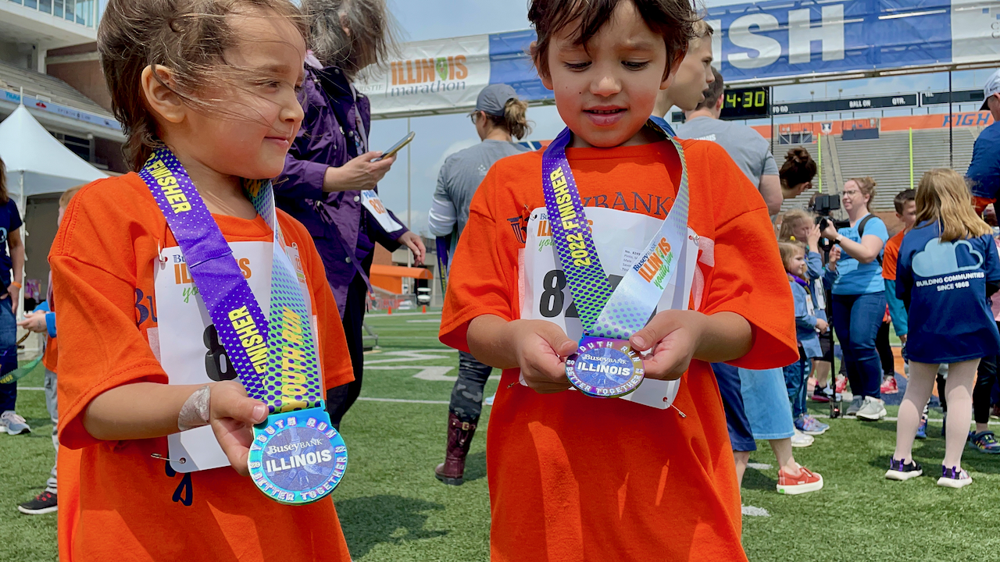
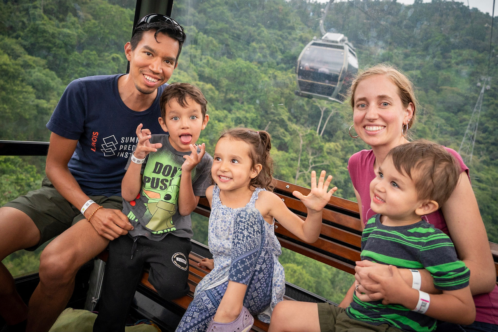

**Dear family and friends,**

It's crazy to think that we're now at the end of another year. We hope that 2022 has treated you and your loved ones well! Here is some of what the Pinto family has been up to.

**Juan** is halfway through his PhD program. He's finished his coursework and will be taking his qualifying exams this coming semester 📚. He's thoroughly enjoying his studies and feels like he's constantly expanding his research and data science abilities. He completed his first gravel bike race this year 🚴🏽‍♂️, as well as a sprint triathlon and 10k run, but it's been harder to find the time to train lately.

**Jaime** finished the first semester of her dental hygiene program 🦷, which was not easy. Despite the stress, she managed to get excellent grades, and she's excited about all the useful things she's learning to help her future patients. In addition to traveling with the family this year, she also spent some time in Colorado with her girlfriends ⛰️.

**Ishmael** is now in first grade and just won't stop getting older. He can sit on the floor and draw for hours on end or flip through his favorite book series, Dog Man 🐶👮‍♂️. He also loves playing with his best friend who comes over often! Meanwhile, **Lucia** and **Joaquin** started attending a new preschool (Joaquin's very first preschool). It's on the University of Illinois campus, which means that Juan gets to take them on the bike trailer whenever he goes to campus. They love the trip, especially going under the big bell tower on campus 🔔. All three kiddos spend their time at home running around the house, making up games, dancing and sweating nonstop.

**Here's some other updates on our lives:**

- We did more traveling this summer than we've done in a long time, and it was glorious. We spent over three weeks in Colombia 🇨🇴 and about two weeks in Utah 🏔️. It was so fun to see family and friends and to enjoy the lush green Andes and the rocky Rockies—such a stark contrast to the plains of central Illinois. And we even got to ride a pedal car between the oceans in Panama 🇵🇦! We're now spending the holidays in Houston with Jaime's sister's family and enjoying watching the kids play with their cousins.
- Jaime's mom has temporarily moved out here to help with the kids while we're in school. The few months she's been here have already been such a game-changer. In December, Juan's mom also moved out here to be closer to her grandchildren, which we're really excited about 🎉.
- We adopted our second cat 🐱, who the kids named Blue (after both the raptor from Jurassic World and the dog in Blue's Clues). She's literally the best cat. However, we sadly decided to find a new home for our Shih Tzu dog 🐶 because his personality made him a bit too anxious and unhappy around our crazy kiddos.

To keep our end-of-year tradition going, here is our memories video for 2022, with one second for (almost) every day:



We'd love to hear from you! Please feel free to reach out and keep us posted on your own goings-ons. Happy new year 🎉🍾!

Love,\
**Juan, Jaime, Ishmael, Lucia, and Joaquin**\
👨🏽👩🏼👦🏻👧🏻👶🏻🐱🐱

