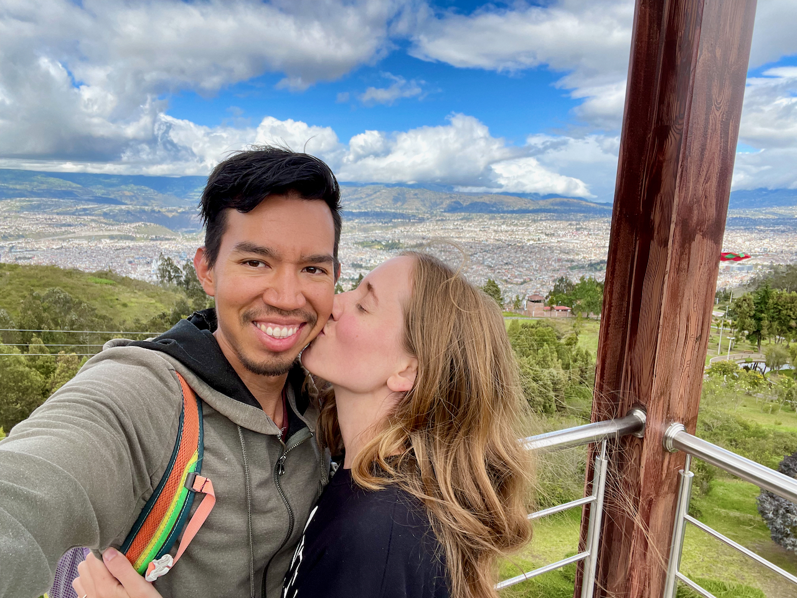
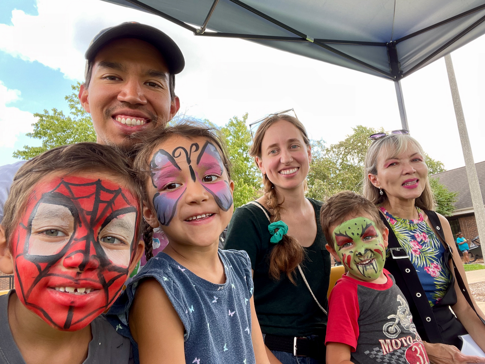

**Dear family and friends,**

Here we are again, at the end of yet another year full of adventures and growth. Time does not stop, and neither do we. We hope you enjoy this brief update on the lives of the Pintos, and we hope to hear about your own adventures soon!

**Jaime** has been busy working at the Parkland dental hygiene clinic 🦷, where she cleans teeth, takes x-rays, and injects people with needles. Juan was her very first patient and survived---so, you know, that's a good sign! She's now getting ready for her board exams, which she'll be taking in the spring. She also got an accordion 🪗 to add to the Pinto wall of instruments, and she's been slowly getting better at it (diatonic accordions are hard!).

**Juan** is beginning to work on his dissertation while still trying to keep up with all his other projects. He joined one of the NSF AI Institutes this year, which has provided some additional and exciting research opportunities 👨🏾‍💻. He continues to bike everywhere, though less for exercise and more to just get around and enjoy the ride. He's also gotten more involved in the local community, advocating for better bike lanes, safer streets, and affordable housing 🏘️ for everyone.

**Ishmael** is killing it in second grade, where he's been improving his English and Spanish reading skills and loves doing math challenges. He loves playing the piano 🎹, especially learning songs by ear or improvising his own. He can often be found with his nose in one of the "Bad Guys" books 📚, solving his Rubik's cube for the thousandth time, or asking his parents to *please* let him play "Among Us" one more time.

**Lucia** is now in kindergarten, which means she gets to ride the bus 🚌 with Ishmael. She had a few rough first days adjusting to big kid school, but she quickly made friends and now loves her class! She adores our two "cutie" cats 🐈🐈‍⬛ and wants to be a veterinarian *AND* artist when she grows up. She is bursting with energy during the day but falls asleep instantly when her head hits the pillow at night.

**Joaquin** is now the last of the kiddos in preschool, but he has so much fun there that he sometimes doesn't want to go home! Contrary to our expectations, he loves trains 🚂 even *MORE* than before. He's more picky with his food than he used to be, but when he finds something he likes, he *really* enjoys it 🌮. More than anything else, though, he loves to play with his big brother and sister.

.")

**Some additional updates:**

- We decided to buy a front-loader cargo bike 🚲 (look up *bakfiets* on YouTube). It fits all three kids easily (with seatbelts!), and we now use it to go to the library, school, parks, the grocery store, and pretty much everywhere else in town. Since we bought it in May, we've put about 1,200 miles on it 😲. It's just such a blast to ride!
- We love having family nearby! The kids often run to Juan's mom's apartment down the street, where they do lots of art projects together 🎨. We've also had Jaime's parents temporarily living across the street and helping out tremendously with the kids. We regularly have dinner with Jaime's sister in town, and now her brother and his family are also moving here, which means more cousins to play with 🎉! We're basically building a Pinto-Fifield compound here in Champaign-Urbana.
- We had an exciting summer visiting family in Colombia 🇨🇴 and Ecuador 🇪🇨 and hanging out in Mexico 🇲🇽! Juan also got to visit Australia 🇦🇺 for an academic conference. The kids' Houston cousins came up to visit in the summer and fall, and now we're visiting them for some warmer holidays. We love having so much extended-family time!

And now---for the 7th year in a row---here's our 2023 memories video:



As always, **we would love to hear from you**! Please feel free to [email us](mailto:family@jdpinto.com) with as long or short of an update as you want. We wish you all a happy, fulfilling, and exciting new year---have an awesome 2024 🎉🍾!

Love,\
**Juan, Jaime, Ishmael, Lucia, and Joaquin**\
👨🏽👩🏼👦🏻👧🏻👶🏻🐱🐱

