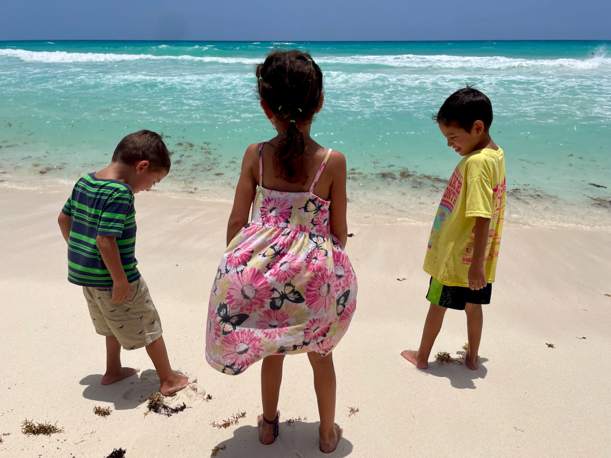
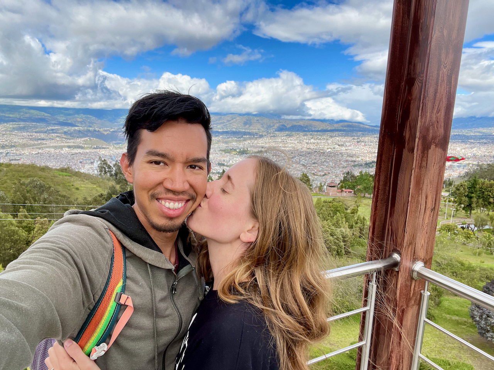
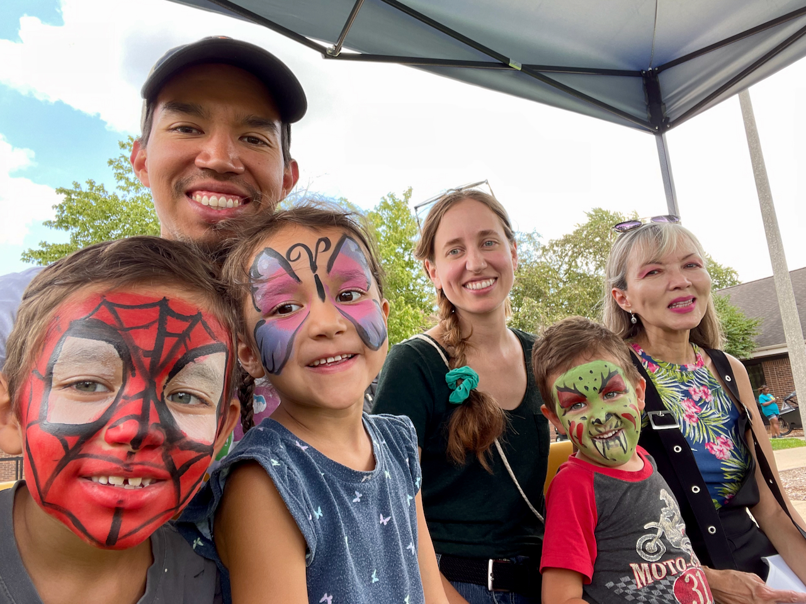

**Querida familia y amigos,**

Aquí estamos de nuevo, al final de un año más lleno de aventuras y crecimiento. El tiempo no se detiene y nosotros tampoco. Esperamos que disfruten de esta breve actualización sobre la vida de la familia Pinto-Fifield y ¡esperamos escuchar pronto sobre sus propias aventuras!

**Jaime** ha estado ocupada trabajando en la clínica de higiene dental Parkland 🦷, donde ella limpia los dientes, toma radiografías, y les pone inyecciones dolorosas a las personas. Juan Daniel fue su primer paciente y sobrevivió, así que, ya sabes, ¡esa es una buena señal! Ahora ella se está preparando para los exámenes de la junta dental, que realizará en la primavera. También consiguió un acordeón 🪗 para agregar al muro de instrumentos de la familia, y poco a poco ha ido mejorando (¡los acordeones diatónicos son difíciles!).

**Juan** está comenzando a trabajar en su tesis doctoral mientras intenta mantenerse al día con todos sus otros proyectos. Este año se unió a uno de los institutos de inteligencia artificial de la Fundación Nacional de Ciencia, lo que le brindó algunas oportunidades de investigación adicionales e interesantes 👨🏾‍💻. Continúa andando en bicicleta a todas partes, aunque no tanto para hacer ejercicio sino para moverse de un lado a otro y disfrutar del viaje. También se ha involucrado más en la comunidad local, abogando por mejores carriles para bicicletas, calles más seguras y viviendas asequibles 🏘️ para todos.

**Ishmael** está triunfando en segundo grado, donde ha estado mejorando sus habilidades de lectura en inglés y español y le encanta hacer desafíos de matemáticas. Le encanta tocar el piano 🎹, especialmente aprender canciones al oído o improvisar las suyas propias. A menudo se le puede encontrar con la nariz metida en uno de los libros de “Bad Guys” 📚, resolviendo su cubo de Rubik por milésima vez o pidiéndole a sus padres que *por favor* le dejen jugar “Among Us” una vez más.

**Lucía** está ahora en el jardín de infantes, lo que significa que puede viajar en el autobús 🚌 con Ishmael. Tuvo unos primeros días difíciles para adaptarse a la escuela de niños grandes, pero rápidamente hizo amigos y ahora le encanta su clase. Ella adora a nuestros dos “linditos” gatos 🐈🐈‍⬛y quiere ser veterinaria *Y* artista cuando sea mayor. Está llena de energía durante el día, pero se queda dormida instantáneamente cuando su cabeza toca la almohada por la noche.

**Joaquín** es ahora el último de nuestros niños en preescolar, ¡pero se divierte tanto allí que a veces no quiere volver a casa! Contrariamente a nuestras expectativas, le encantan los trenes 🚂 incluso *MÁS* que antes. Es más exigente con la comida que antes, pero cuando encuentra algo que le gusta, lo disfruta *mucho* 🌮. Sin embargo, más que nada le encanta jugar con su hermano y su hermana mayores.

.")

**Algunas actualizaciones adicionales:**

- Decidimos comprar una bicicleta de carga con carga frontal 🚲 (pueden buscar *“bakfiets”* en YouTube). Se adapta fácilmente a los tres niños (¡con cinturones de seguridad!) y ahora la usamos para ir a la biblioteca, la escuela, los parques, el supermercado y prácticamente a cualquier otro lugar de la ciudad. Desde que lo compramos en mayo, ya hemos recorrido unas 1200 millas (1900 kilometros) 😲. ¡Es una maravilla montarla!
- ¡Nos encanta tener familia cerca! Los niños suelen correr al apartamento de la mamá de Juan Daniel, al final de la calle, donde hacen muchos proyectos de arte juntos 🎨. También tuvimos a los padres de Jaime viviendo temporalmente al otro lado de la calle y ayudando enormemente con los niños. Cenamos regularmente con la hermana de Jaime en la ciudad, y ahora su hermano y su familia también se mudarán aquí, ¡lo que significa más primos con quienes jugar 🎉! Básicamente, estamos construyendo un complejo Pinto-Fifield aquí en Champaign-Urbana.
- ¡Tuvimos un verano emocionante visitando a familiares en Colombia 🇨🇴 y Ecuador 🇪🇨 y pasando un rato en México 🇲🇽! Juan también visitó Australia 🇦🇺 para una conferencia académica. Los primos de los niños de Houston vinieron a visitarnos en el verano y el otoño, y ahora los visitaremos para pasar unas vacaciones más cálidas. ¡Nos encanta pasar tanto tiempo en familia!

Y ahora, por séptimo año consecutivo, aquí está nuestro vídeo de recuerdos de 2023:



Como siempre, **¡nos encantaría saber de ustedes!** No duden en [mandarnos un correo electrónico](mailto:family@jdpinto.com) con una actualización tan larga o breve como deseen. Les deseamos a todos un feliz, satisfactorio y emocionante año nuevo. ¡Que tengan un fantástico 2024 🎉🍾!

Con amor,\
**Juan, Jaime, Ishmael, Lucía y Joaquín**
👨🏽👩🏼👦🏻👧🏻👶🏻🐱🐶

