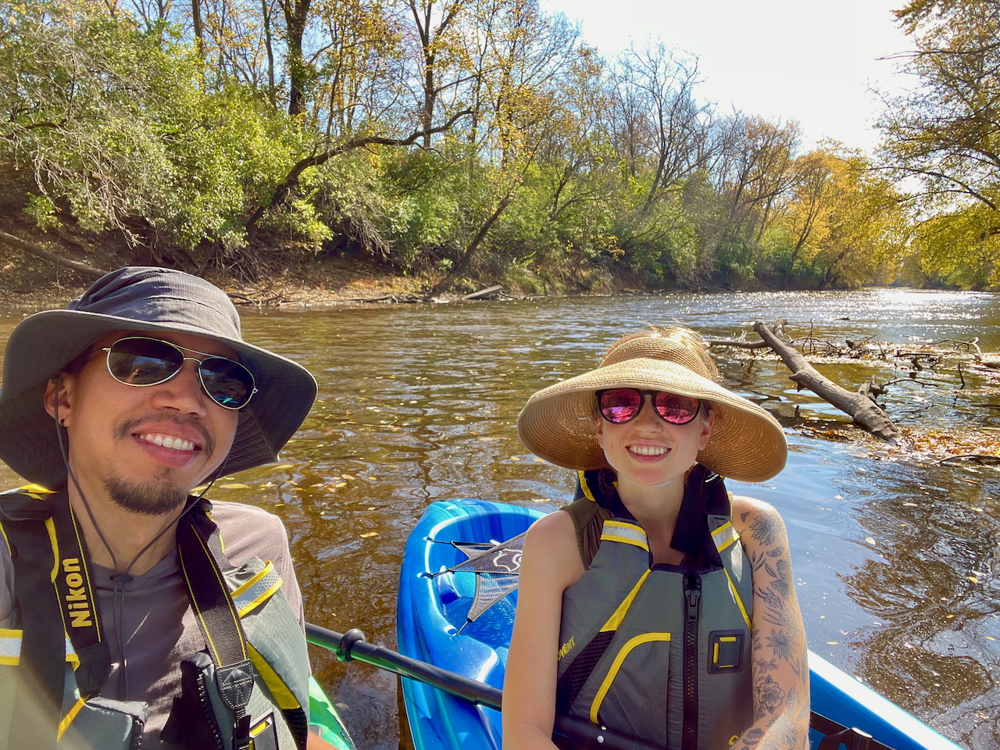
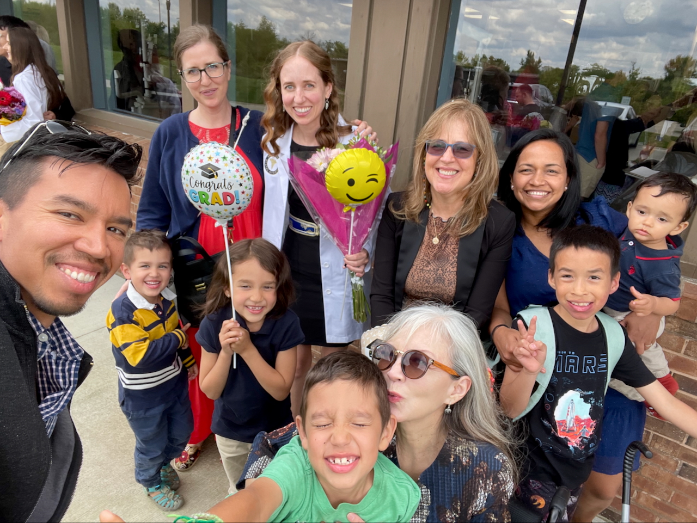

**Dear family and friends,**

We hope 2024 has brought you much joy! Here is a small update on the Pinto family's adventures this past year. We hope you enjoy it, and we look forward to hearing about your own adventures!

**Jaime** passed her board exams and started working as a dental hygienist 🦷 at a local dentist office! She enjoys getting to know her patients by asking questions about their lives and trying to interpret their responses while their mouths are full of dental instruments.

**Juan** became passionately interested in birds 🦤 this year---a clear sign of his old age. He has begun the (hopefully) final year of his PhD program and is now starting to get stressed out about job hunting. Anyone looking for a data scientist with domain expertise in education?

**Ishmael** loves telling everyone he meets that he's the best at math in his third-grade class and asking them to quiz him. He also fills our home with endless piano music 🎹. Who knew we'd have to tell our child to *stop* practicing piano so much?

**Lucia** adores animals and likes to go birding with her dad (especially if he promises she'll see some blue jays). Despite her complaints about her brothers, she loves exploring the outdoors while pretending to be "cutie" animals 🐈 with them.

**Joaquin** is in his last year of preschool where he loves learning about the solar system and dinosaurs 🦖. He's set on being both a construction worker and train conductor when he grows up so that he can drive the train he builds himself.

**A couple of additional updates:**

- One big change for all of us has been having Jaime's brother's family, previously living in Ecuador, move just down the street from us. The kids have a blast playing with their cousins, and we now get to have regular board game nights 🎲 with other adults! Along with Juan's mom and Jaime's sister's family living nearby, Champaign-Urbana just keeps feeling more and more like home.
- The kiddos have been doing gymnastics 🤸 for a few months now, and it's been so fun to see their progress. It does, however, mean learning to expect random cartwheels at all times and places. We've even had to set new ground rules so that they stop accidentally smacking each other in the face when trying to perfect their technique in our small townhouse.

And of course, as has become tradition, here is our 2024 memories video, with one second for (almost) every day (you can see our past videos [here](https://jdpinto.com/family/)):



Please do [reach out](mailto:family@jdpinto.com) and let us know how you're doing! We're always thrilled to hear about your own adventures. Have a fantastic 2025 🎉🍾!

Love,\
**Juan, Jaime, Ishmael, Lucia, and Joaquin**\
👨🏽👩🏼👦🏻👧🏻👶🏻🐱🐱

