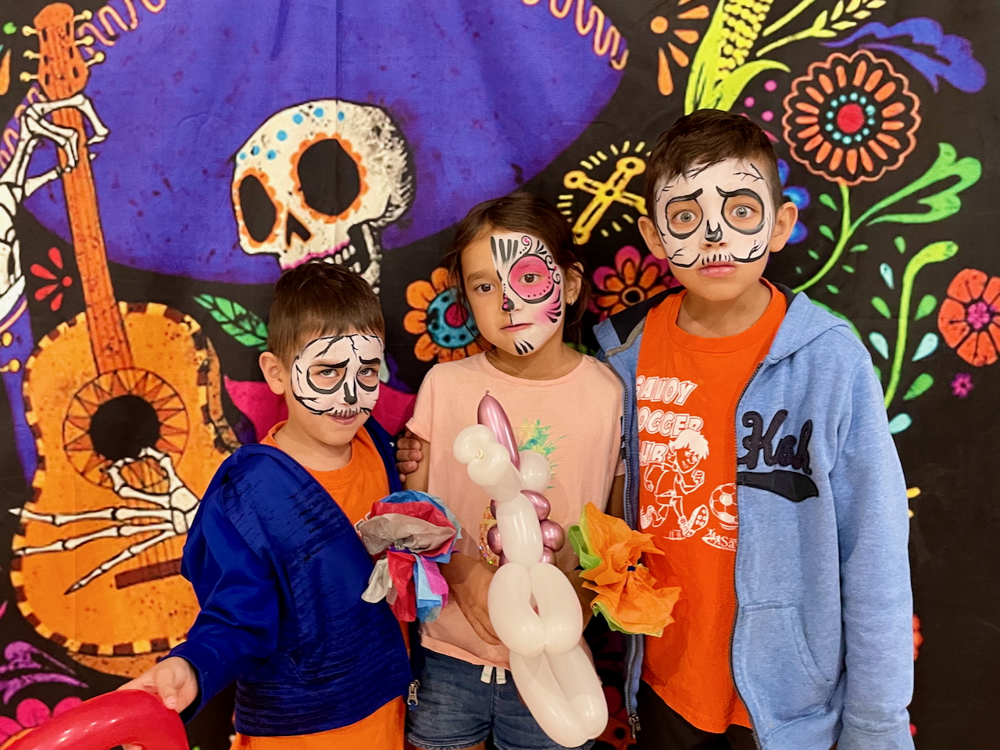
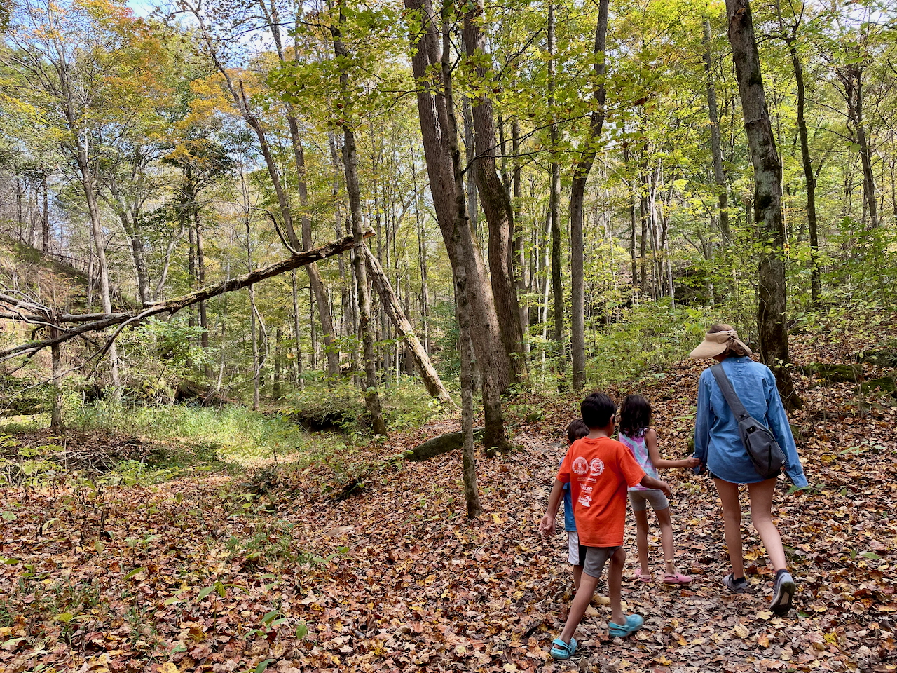
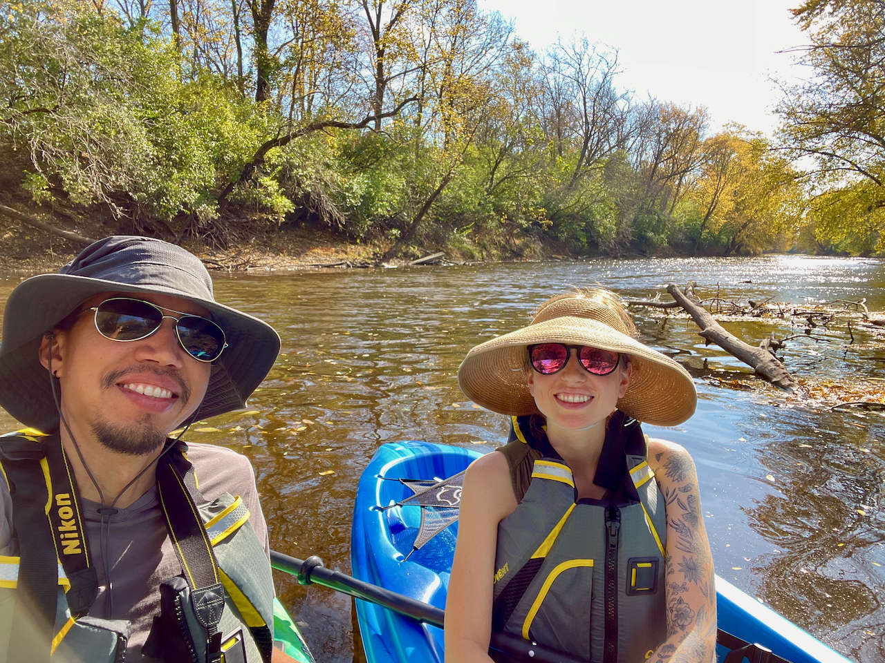
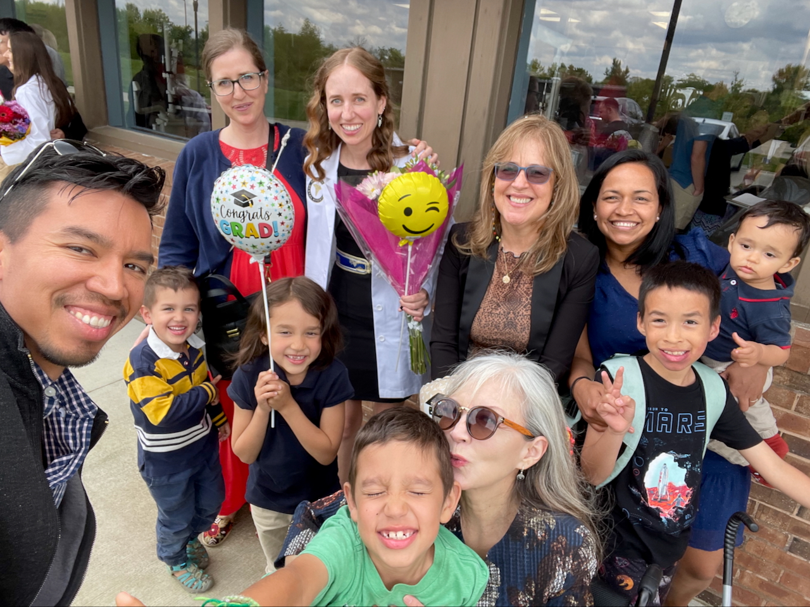

**Querida familia y amigos,**

¡Esperamos que el año 2024 les haya traído mucha alegría! Aquí tienen una pequeña actualización sobre las aventuras de la familia Pinto-Fifield este año. ¡Esperamos que la disfruten y estamos ansiosos por escuchar sobre sus propias aventuras!

**Jaime** aprobó sus exámenes de certificación y empezó a trabajar como higienista dental 🦷 en una clínica local. Disfruta conociendo a sus pacientes, haciendo preguntas sobre sus vidas y tratando de interpretar sus respuestas mientras tienen la boca llena de instrumentos dentales.

**Juan** desarrolló una gran pasión por las aves 🦤 este año---una clara señal de su vejez. Ha comenzado el último año (eso esperemos) de su programa de doctorado y ya empieza a estresarse con la búsqueda de empleo. ¿Alguien busca un científico de datos con experiencia en el ámbito educativo?

**Ishmael** adora decirle a todos los que conoce que es el mejor en matemáticas de su clase de tercer grado y pedirles que le hagan preguntas. También llena nuestra casa con música interminable de piano 🎹. ¿Quién iba a imaginar que tendríamos que decirle a nuestro hijo que *deje* de practicar tanto?

**Lucía** ama a los animales y le encanta ir a observar aves con su papá (especialmente si le promete que verá algún arrendajo azul). A pesar de sus quejas sobre sus hermanos, le encanta explorar la naturaleza mientras finge ser "lindos" animales 🐈 con ellos.

**Joaquín** está en su último año de preescolar, donde le encanta aprender sobre el sistema solar y los dinosaurios 🦖. Está decidido a ser tanto obrero de construcción como conductor de tren cuando crezca, para poder conducir el tren que él mismo construya.

**Algunas actualizaciones adicionales:**

- Un gran cambio para todos nosotros ha sido que la familia del hermano de Jaime, que vivía en Ecuador, se mudó a solo unas casas de distancia. Los niños se divierten mucho jugando con sus primos, ¡y ahora tenemos noches regulares de juegos de mesa 🎲 con otros adultos! Junto con la mamá de Juan y la familia de la hermana de Jaime viviendo cerca, Champaign-Urbana cada vez se siente más como nuestro hogar.
- Los niños han estado haciendo gimnasia 🤸 durante unos meses, y ha sido muy divertido ver su progreso. Sin embargo, esto implica acostumbrarse a esperar volteretas en cualquier momento y lugar. Incluso hemos tenido que establecer nuevas reglas para que dejen de golpearse accidentalmente la cara mientras intentan perfeccionar su técnica en nuestra pequeña casa.

Y, por supuesto, como ya es tradición, aquí está nuestro video de recuerdos de 2024, con un segundo para (casi) cada día (pueden ver nuestros videos anteriores [aquí](https://jdpinto.com/family/)):



¡Por favor, no duden en [escribirnos](mailto:family@jdpinto.com) y contarnos cómo les va! Siempre nos encanta escuchar sobre sus propias aventuras. ¡Que tengan un fantástico 2025 🎉🍾!

Con amor,\
**Juan, Jaime, Ishmael, Lucía y Joaquín**
👨🏽👩🏼👦🏻👧🏻👶🏻🐱🐶

