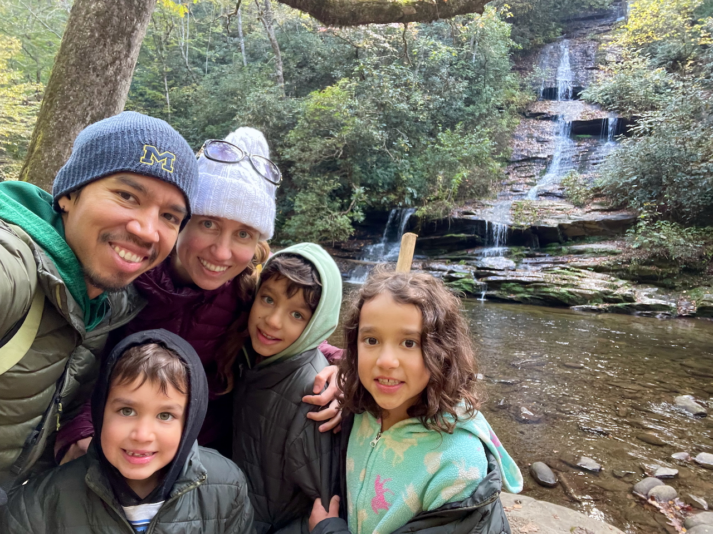
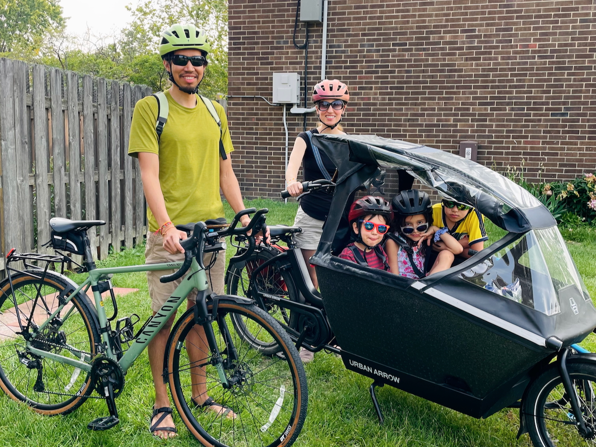
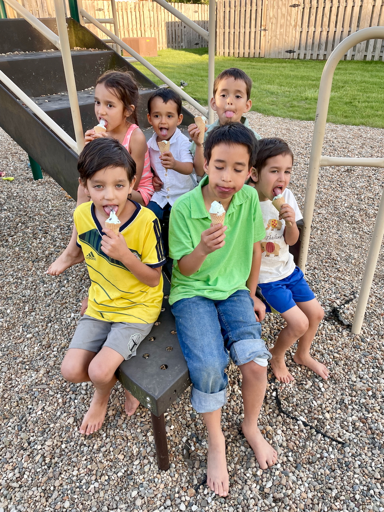

**Querida familia y amigos,**

Otro año ha pasado, trayendo consigo muchas nuevas aventuras y experiencias para recordar. Aquí les compartimos un breve resumen de algunos de los momentos más destacados de nuestra familia en 2025.

**Jaime** completó su primer año como higienista dental en una clínica dental local 🪥. Se siente afortunada de poder conversar con la gente más genial de la ciudad, quienes básicamente le pagan para que actúe como su terapeuta personal. De alguna manera, también logró convencer a Juan de que adoptar un galgo de carreras jubilado saciará su deseo de tener más animales. (Aunque seamos sinceros, todos sabemos que eso no es cierto).

Después de demasiados años de estudio, **Juan** finalmente se graduó con su doctorado este año 🎓. También comenzó su primer trabajo postdoctoral como científico de datos en McGraw Hill. Le han encantado sus primeros meses trabajando en la emocionante intersección de la inteligencia artificial y la educación, aunque su familia todavía no entiende del todo a qué se dedica durante todo el día. Además, digamos que Jaime no está nada triste de que ya no tenga un salario de estudiante.

**Ishmael** ahora está en cuarto grado. Este año ha progresado muchísimo en lectura, matemáticas, piano y gimnasia. Entre sus grandes logros se encuentran memorizar más de 400 dígitos de pi, aprender a tocar *Merry-Go-Round of Life* (de *El castillo ambulante*) en el piano y empatar en el segundo lugar en su categoría de edad en su primera competencia de gimnasia. ¡También le encantó su primer viaje de mochilero este otoño con su papá 🎒!

**Lucía** ahora está en segundo grado. Sigue amando a los animales y el arte, así que nuestras paredes están cubiertas de dibujos de gatitos y perritos con ojos enormes. Pensábamos que su colección de peluches no podía crecer más, pero qué equivocados estábamos. También le encanta la gimnasia y practica constantemente volteretas, aperturas de piernas y dominadas. Últimamente ha mejorado muchísimo su lectura, y ahora su nuevo Kindle de tinta electrónica la mantiene despierta hasta muy tarde por la noche 📚.

**Joaquín** comenzó el jardín de infancia este año y ¡le encanta! Lee bastante bien en español, pero solo a regañadientes en inglés. Le encanta estar en la misma escuela que sus hermanos mayores e ir a gimnasia con ellos. Este año ha destacado mucho académica y socialmente, y en casa es un verdadero payaso. A él y a Lucía les encanta jugar a ser gatitos juntos, y adora a nuestros dos gatos casi tanto como ella.

**Algunas novedades adicionales:**

- ¡Este año estuvo lleno de viajes! Celebramos nuestro décimo aniversario de bodas en Turquía 🇹🇷 y Tailandia 🇹🇭 (sin los niños), donde también pudimos visitar al hermano de Jaime. También fuimos a una reunión familiar de los Pinto en Colombia 🇨🇴, a una reunión familiar de los Fifield en Utah ⛰️, y los niños pudieron jugar con sus primos en Texas durante las fiestas. Juan también pasó unos días en Sicilia 🇮🇹 para su última conferencia académica como estudiante de posgrado durante el verano, algo que echará mucho de menos.
- Jaime ha estado insistiendo mucho para que adoptemos un galgo de carreras jubilado 🐕, y después de años de esfuerzo, ¡parece que finalmente vamos a adoptar uno! Estén atentos a nuestro video de fin de año de 2026, que incluirá muchísimas fotos de perros.
- 2025 marca cinco años desde que nos mudamos a Champaign-Urbana. Ha sido un hogar maravilloso para nosotros 🏡, especialmente con tanta familia cerca. Los niños pueden jugar con sus primos casi todos los días, la mamá de Juan 👵🏼 puede mimar a sus nietos, y nosotros podemos disfrutar de grandes cenas familiares con regularidad.

Como siempre, y por noveno año consecutivo, aquí está nuestro video de recuerdos de 2025, con un segundo por (casi) cada día del año:



Si hace tiempo que no hablamos, ¡nos encantaría [saber de ustedes](mailto:family@jdpinto.com)! Que el 2026 les traiga mucha alegría, satisfacción y más aventuras 🎉🍾!

Con cariño, \
**Juan, Jaime, Ishmael, Lucía y Joaquín**
🧔🏾‍♂️👱🏼‍♀️🧑🏽👧🏽👦🏽🐈🐈‍⬛

